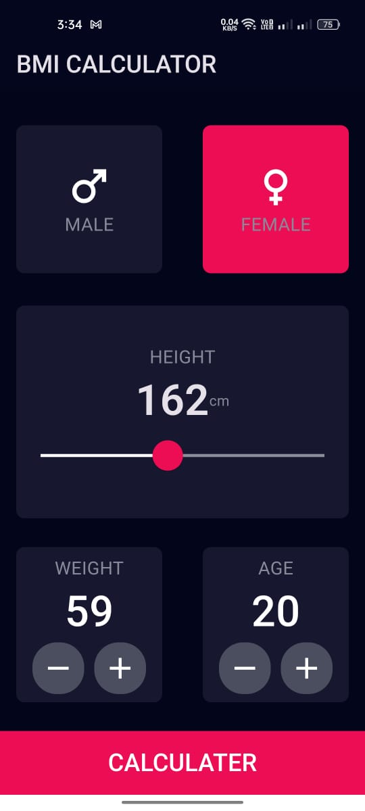
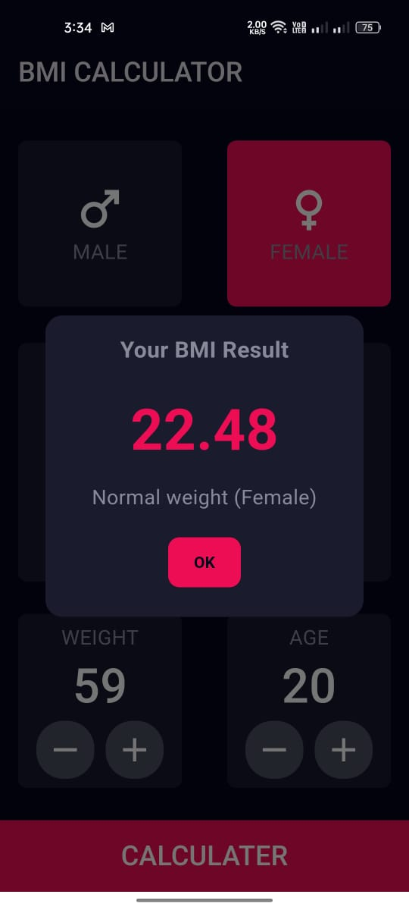

# BMI Calculator Flutter App 🏃‍♂️📱

This is a simple **BMI (Body Mass Index) Calculator** app built using **Flutter**. The app allows users to input their weight, height, and gender to calculate their BMI and determine their weight status (Underweight, Normal weight, Overweight, or Obese). 🌟

## Features 🚀

- **Gender Selection**: Choose between Male 👨 or Female 👩.
- **Height and Weight Inputs**: Adjust height and weight using sliders and buttons. ⚖️
- **BMI Calculation**: Calculate BMI based on the provided weight and height. 📊
- **BMI Status**: Display BMI and determine weight status (Underweight, Normal weight, Overweight, Obese). 📝
- **Modern UI**: Clean and user-friendly interface with a dark theme. 🌑

## 📸 Screenshots
<p align="center">
  
  
</p>

## Installation 🛠️

To run this project locally, follow the steps below:

1. Make sure you have [Flutter](https://flutter.dev/docs/get-started/install) installed on your system. 🖥️
2. Clone this repository:

   ```bash
   git clone https://github.com/azimramadan/bmi_calculator_app.git
